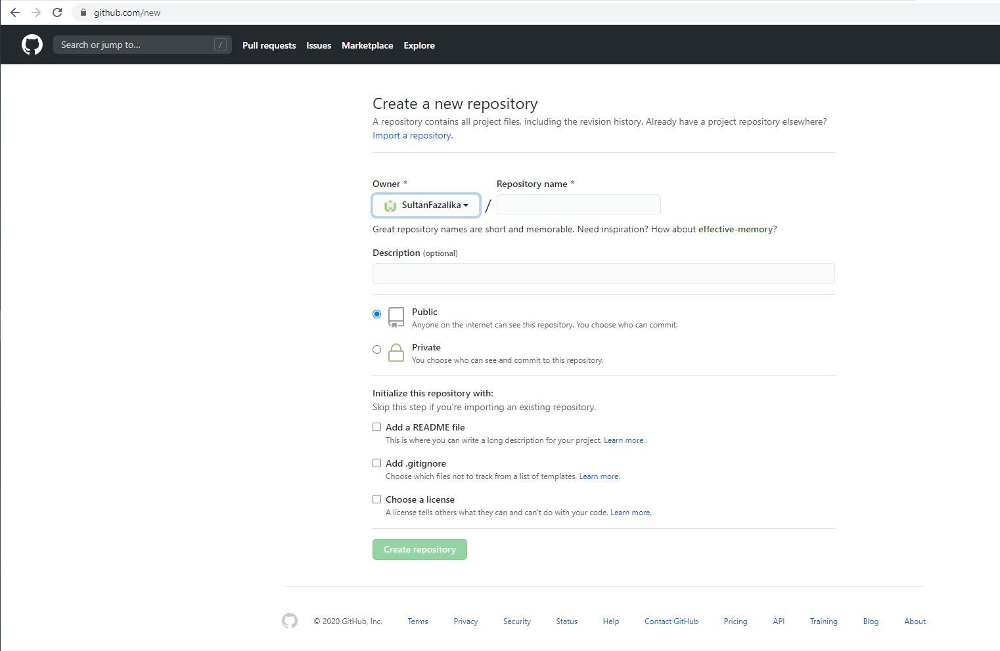
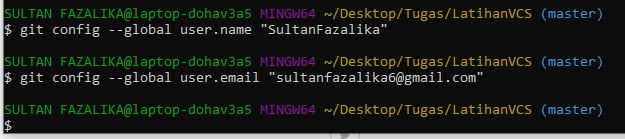
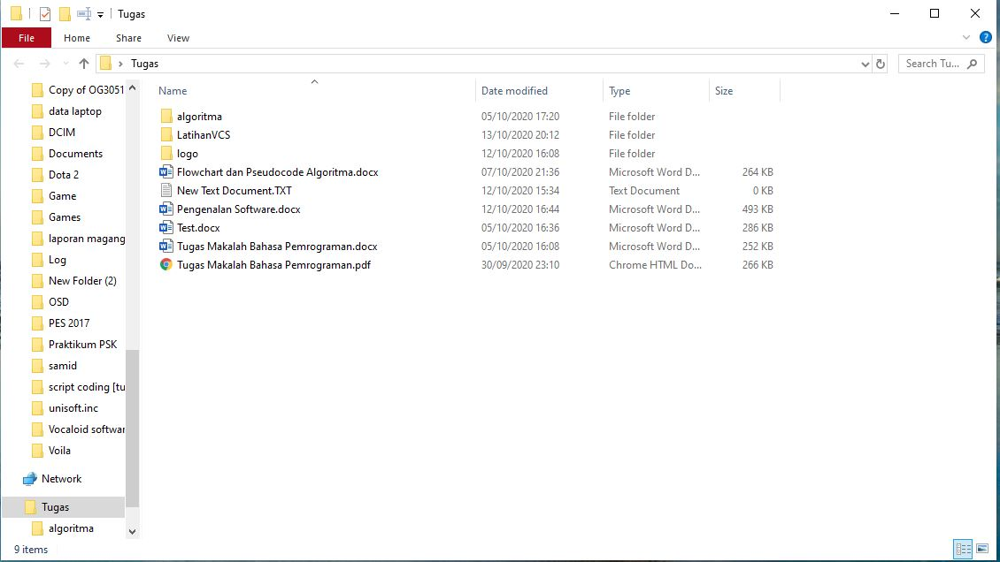
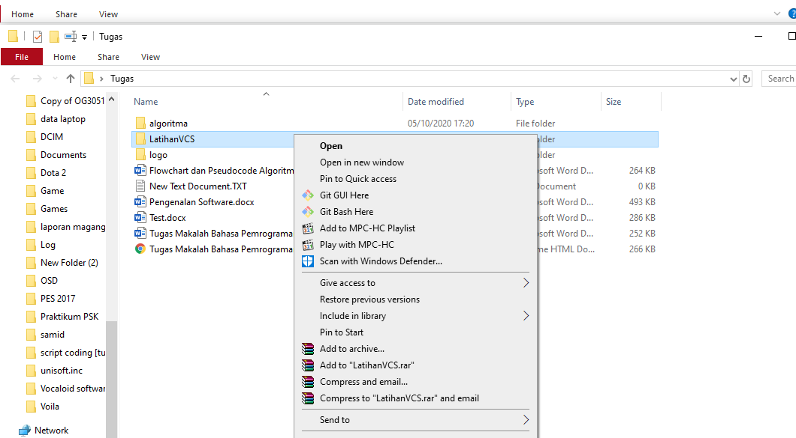
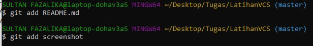
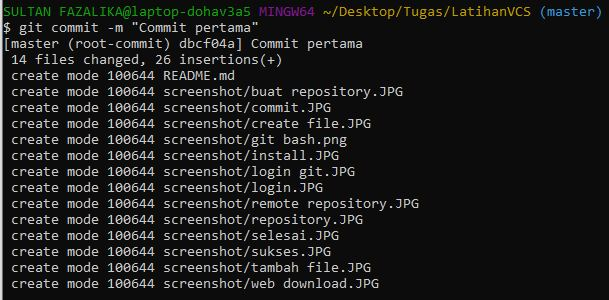
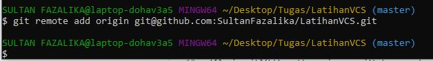
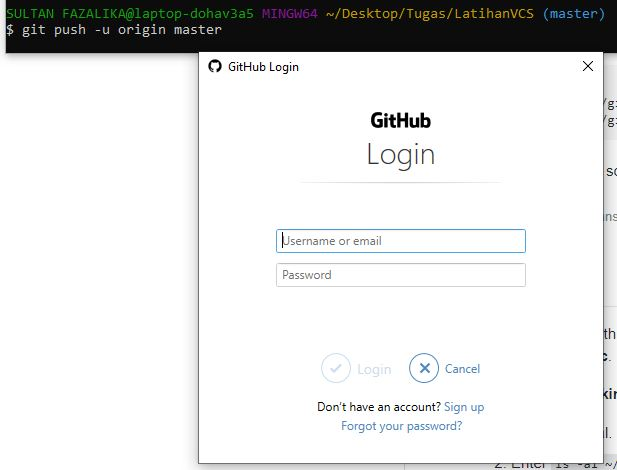
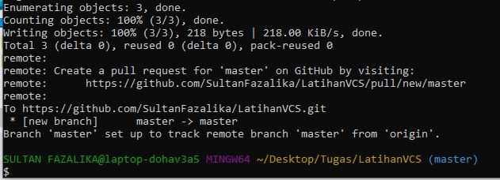

# LatihanVCS

1. Login/buat akun github, lalu buat repository baru

2. Login git pada cmd dengan mengetik
    `$ git config --global user.name "UsernameKalian"`
    `$ git config --global user.email "EmailKalian@mail.com"`

3. Buat folder **"LatihanVCS"** dan buat file **"README.MD"**

4. Klik **"Git Bash Here"** pada folder **"LatihanVCS"**

5. Ubah folder menjadi repository dengan mengetik `$ git init`

6. Tambahkan file ke repository dengan membuat **README.md** lalu ketik `$ git add README.md`

7. Buat commit dengan mengetik `$ git commit -m "Commit Pertama"`

8. Remote repository Github dengan cara mengetik `$ git remote add origin git@github.com:UserNameGit/NamaRepository.git`

9. Push ke Github dengan mengetik `$ git push -u origin master`

10. Jika berhasil maka akan muncul tulisan seperti berikut:

 
